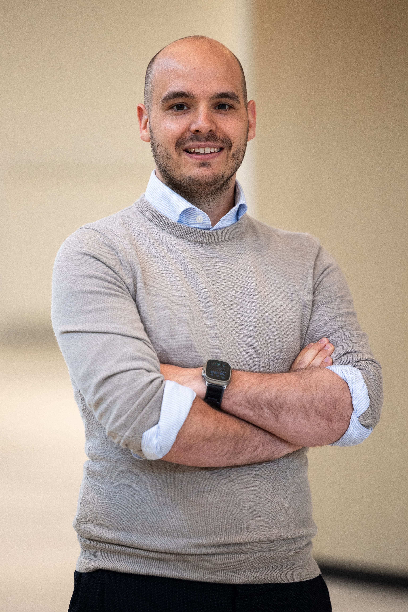

::::: {.intro}

:::: {.portrait}

::::

:::: {.intro__text}
[Postdoctoral researcher]{.eyebrow}

# Senne Vleminckx

[Faculty of Medicine and Health Sciences, University of Antwerp]{.affil}

I research how nursing teams are put together and how they collaborate — and how that shows up in patient and staff outcomes.

Before research, I worked as a nurse in emergency and intensive care.
::::

:::::

::: {.cta-row}
[Consultancy](consultancy.qmd){.pill} [Selected work](work.qmd){.pill}
:::

